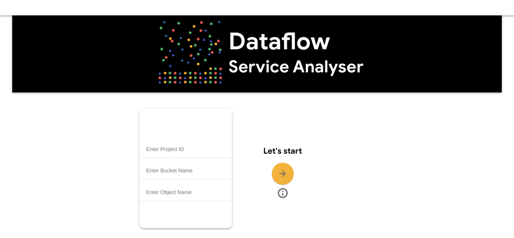
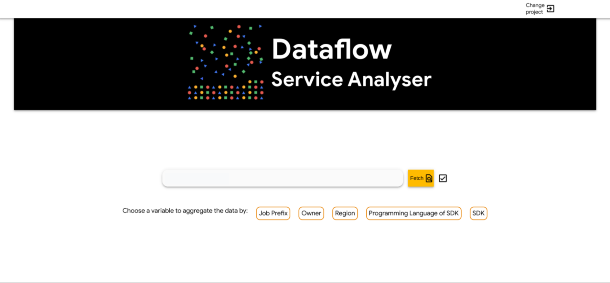
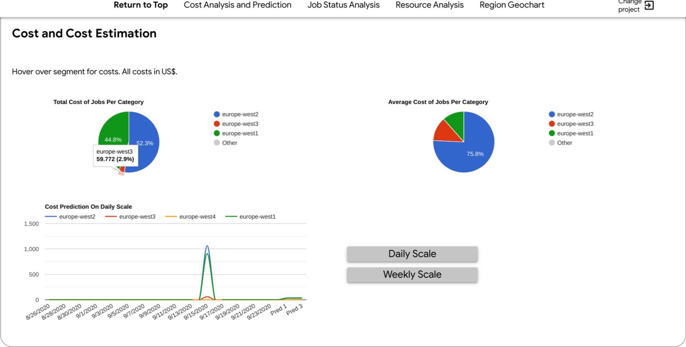
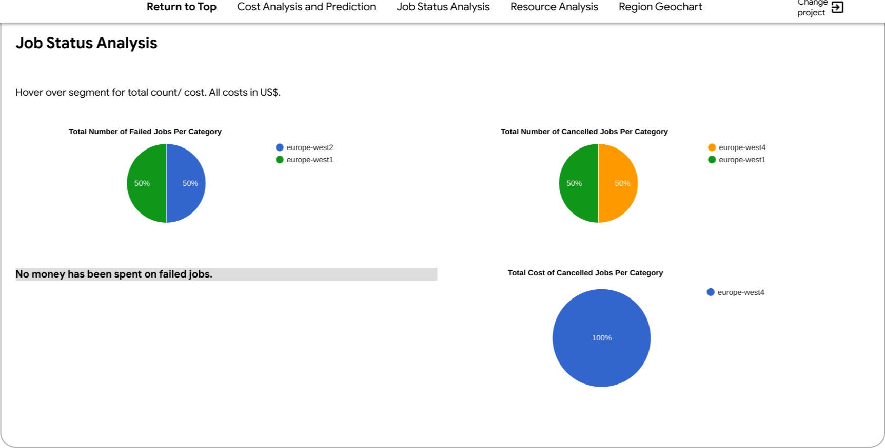
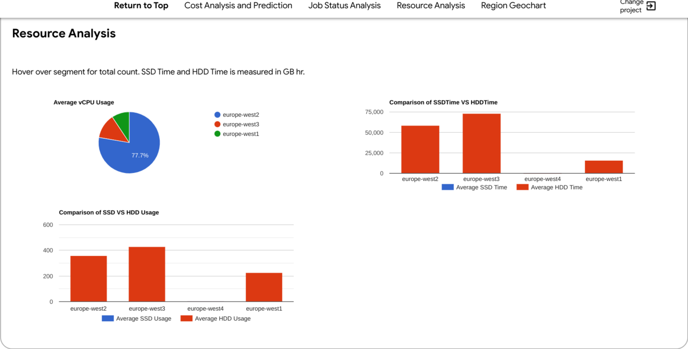
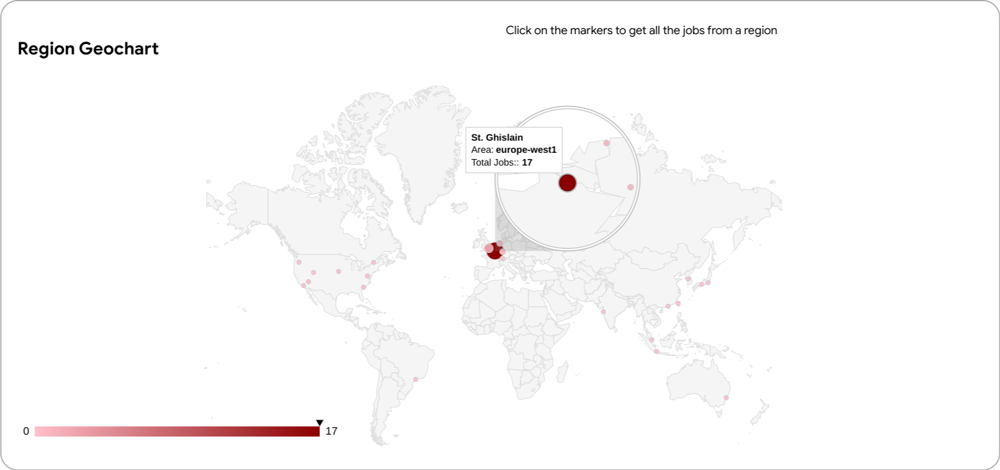

# step229-2020
## Dataflow Service Analyser

This is the capstone project made by Andreea Nica and Tallie Blanshard during their 2020 Google STEP internship.

## What is the Dataflow Service Analyser?

The Dataflow Service Analyser is an open-source web application that takes data from a Google Cloud project's Dataflow jobs and processes them, providing a high-level graphical overview of the project, allowing the user to gain better insight into how they are spending their money and the resources being used by their jobs.

Job data can be aggregated, allowing the user to choose exactly what data they'd like displayed - whether it's aggregated by location, SDK, owner etc.

The graphs displayed include:
- total cost of jobs per category (answering questions such as 'how much money am I spending in europe-west-2?' or 'who's jobs are costing the most?')
- average cost of jobs
- predicted cost (on both a daily and a weekly scale - looking 3 days into the future, and 1 week into the future respectively)
- average vCPU count
- SSD and HDD comparison
- total cost of cancelled/failed jobs
- interactive map showing where various jobs are being run
- and many more...

The first page you see when you open the application.

Once you've entered your details correctly, you can then choose how to aggregate the data.

## Why did we make this?

- Data about a Google Cloud project's Dataflow jobs is scatered across the Google Cloud Console.
- Most of the information is low-level and doesn't, therefore, provide a high-level overview of the project's jobs.
- The Dataflow Service Analyser aims to provide a high-level, graphical overview of the project's jobs - answering questions the user might have such as:
  - How much am I spending on cancelled jobs?
  - Where are most of my jobs being run?
  - How much am I spending in each region?
  - Which jobs are using outdated SKDs?
  - Which owner's jobs have used the most virtual CPUs on average?
  - and many more...
  
## Technologies used

### Front-End
- HTML/CSS
- JavaScript (using the Google Chart API to display the graphs)
### Back-End
- Java (to create Java Servlets)
- A wide range of Google APIs
  - Dataflow
  - Datastore
  - Cloud Resource Manager
  - Cloud Storage
